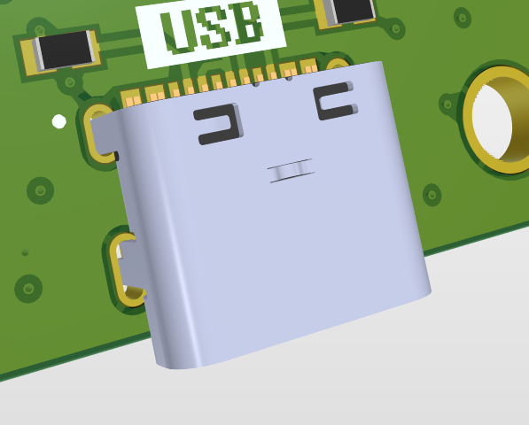

# Firefly
Archival repository for the Firefly Project. Casually referred to as Universal Mainboard within StrathSEDS. It is the spirit successor of SHAMANBoard.

Firefly is ... [TODO]

You can use the Outjob files for generating manufacturing files, all of which are included in the JLCPCB folder